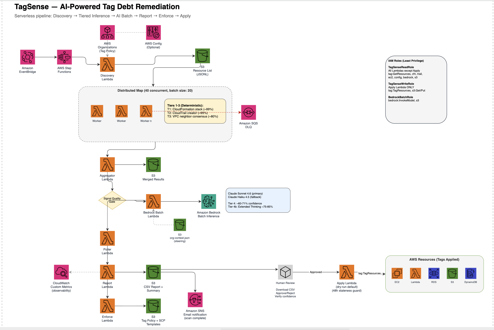
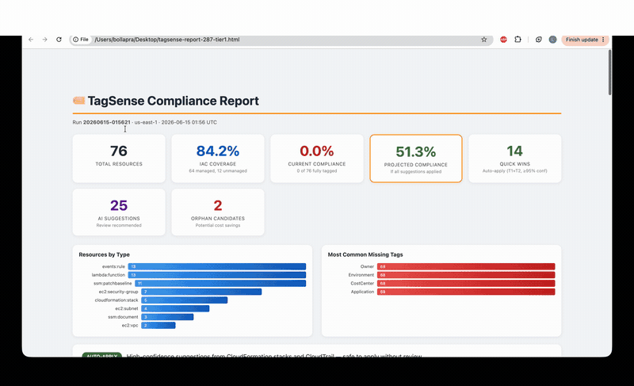

# TagSense — AI-Powered Retroactive Resource Tagging

[](https://opensource.org/licenses/MIT-0)
[](https://www.python.org/downloads/)
[](https://aws.amazon.com/serverless/sam/)

Deploy with two commands. Get a compliance report with AI-inferred tag recommendations. Review. Apply. Enforce.

## Why TagSense

Tagging is the foundation of cloud governance — cost allocation, security scoping, operational ownership, and compliance reporting all depend on resources being correctly tagged. Yet most organizations carry significant tagging debt: untagged or inconsistently tagged resources that accumulate over time as teams scale, staff rotate, and automation gaps persist.

**The problem:** AWS Config and tag policies can *detect* missing tags, but they cannot *resolve* them. They tell you "this resource is missing an Application tag" — not what the value should be. The only option today is manual audit, which doesn't scale across hundreds of accounts and thousands of resources.

**TagSense fills this gap** by intelligently inferring what tag values should be using a tiered approach that prioritizes deterministic evidence over guessing, and flags uncertainty honestly rather than applying wrong tags.

### Where TagSense Fits in Your Governance Framework

```
┌─────────────────────────────────────────────────────────────────┐
│                    Cloud Governance Stack                         │
├─────────────────────────────────────────────────────────────────┤
│  PREVENT    │ SCPs, Tag Policies, EventBridge auto-tag rules     │
│             │ (TagSense generates these templates)               │
├─────────────────────────────────────────────────────────────────┤
│  DETECT     │ AWS Config required-tags, Tag Editor compliance    │
│             │ (TagSense integrates as policy source + filter)    │
├─────────────────────────────────────────────────────────────────┤
│  REMEDIATE  │ ★ TagSense — AI-inferred tag recommendations ★    │
│             │ (fills the gap between detection and resolution)   │
├─────────────────────────────────────────────────────────────────┤
│  ENFORCE    │ Config rules, SCPs, Organization tag policies      │
│             │ (TagSense outputs feed back into enforcement)      │
└─────────────────────────────────────────────────────────────────┘
```

### Governance & Compliance Outcomes

| Outcome | How TagSense Helps |
|---------|-------------------|
| **Cost allocation** | Infers `CostCenter` and `Application` tags so spend is attributable to teams and workloads |
| **Security scoping** | Infers `Owner` and `Environment` tags enabling blast radius analysis and access control by tag |
| **Audit readiness** | Generates compliance reports with confidence scores and evidence trails for auditors |
| **Operational ownership** | Identifies resource creators via CloudTrail and assigns `Owner` tags with provenance |
| **Drift prevention** | Outputs SCP and Tag Policy templates to prevent future tagging gaps |
| **Orphan detection** | Flags resources with no identifiable owner or purpose for decommission review |

### Key Design Principles

- **Accuracy over coverage** — A wrong tag is worse than no tag. TagSense stops at the first high-confidence match and honestly flags resources it cannot resolve.
- **Human-in-the-loop** — No tags applied without explicit approval. CSV report includes confidence scores and reasoning for every suggestion.
- **Config-aware** — Integrates with your existing AWS Config rules as the source of truth, not a parallel system.
- **Enforce what you fix** — After remediation, TagSense generates SCP and Tag Policy templates to prevent the same gaps from recurring.

## Quick Start

```bash
git clone https://github.com/aws-samples/sample-genai-tag-debt-remediation.git
cd sample-genai-tag-debt-remediation
sam build
sam deploy --guided --capabilities CAPABILITY_NAMED_IAM
```

SAM handles everything — packages Lambda code, uploads to S3, deploys CloudFormation. No manual zipping or shell scripts.

### Post-Deploy, Pre-First-Scan (Optional but Recommended)

The S3 bucket is created during deploy. Before running your first scan, upload your organization context to improve AI accuracy:

```bash
# Copy the sample and edit with your org's values
cp org-context.sample.json org-context.json
# Edit: add your cost centers, teams, applications, naming conventions
# Then upload:
aws s3 cp org-context.json s3://tagsense-results-$(aws sts get-caller-identity --query Account --output text)/tagsense/context/org-context.json
```

Without this file, Tier 4 AI inference still works but suggests freeform values. With it, suggestions are constrained to YOUR valid values.

### Run First Scan

```bash
# Start scan and capture execution ARN
EXEC_ARN=$(aws stepfunctions start-execution \
  --state-machine-arn $(aws cloudformation describe-stacks --stack-name tagsense \
    --query "Stacks[0].Outputs[?OutputKey=='StateMachineArn'].OutputValue" --output text) \
  --input '{"region": "us-east-1"}' \
  --query "executionArn" --output text)
echo "Started: $EXEC_ARN"

# Check status (re-run until SUCCEEDED)
aws stepfunctions describe-execution --execution-arn $EXEC_ARN --query "status" --output text
```

Status will be `RUNNING` → `SUCCEEDED`. Typical runtime: 5-10 minutes for ~2,000 resources.

### Download Results

Once status is `SUCCEEDED`:

```bash
# Set your bucket name
BUCKET=tagsense-results-$(aws sts get-caller-identity --query Account --output text)

# Get latest run ID (timestamp format: YYYYMMDD-HHMMSS)
RUN_ID=$(aws s3 ls s3://$BUCKET/tagsense/ --region us-east-1 | awk '{print $2}' | grep '^[0-9]' | tr -d '/' | sort | tail -1)
echo "Latest run: $RUN_ID"

# View summary in terminal
aws s3 cp s3://$BUCKET/tagsense/$RUN_ID/summary.txt - --region us-east-1

# Download HTML report
aws s3 cp s3://$BUCKET/tagsense/$RUN_ID/report.html ./report.html

# Download review CSV
aws s3 cp s3://$BUCKET/tagsense/$RUN_ID/review.csv ./review.csv
```

### Parameters

| Parameter | Default | Description |
|-----------|---------|-------------|
| `BedrockModelId` | `us.anthropic.claude-sonnet-4-6` | Primary model for AI inference |
| `BedrockFallbackModelId` | `us.anthropic.claude-haiku-4-5-20251001-v1:0` | Fallback on throttle |
| `NotificationEmail` | *(empty)* | Email for scan completion + failure alerts |
| `ConfigRuleName` | *(empty)* | AWS Config rule for policy-aware mode |
| `ScheduleExpression` | `rate(7 days)` | Automated scan frequency |
| `MaxResources` | `10000` | Resources processed per scan |
| `MaxBedrockCalls` | `500` | AI calls per scan (cost control) |
| `StartFromTier` | `1` | Start inference from this tier (1-5). Set to 3 to force neighbor consensus, 4 for AI-only. |

## Architecture



```
                    ┌─────────────────────────────────────┐
                    │  AWS Organizations (Auto-discovered)  │
                    │  • Tag policy via DescribeEffective   │
                    │    Policy (zero config)               │
                    └──────────┬───────────────────────────┘
                               │
                    ┌──────────┼─────────────────────────────┐
                    │  AWS Config Integration (Optional)      │
                    │  • Non-compliant resource pre-filter    │
                    │  • Allowed values constraint            │
                    └──────────┬────────────┬────────────────┘
                     Policy ───┘            └─── Targets
                               ▼            ▼
EventBridge (scheduled) / Manual Trigger
        │
  Step Functions Pipeline
        │
  Discovery Lambda ──► S3 (resource list as JSONL)
        │               Phase 1: Build IaC stack map (all CFN stacks → resources)
        │               Phase 2: Scan all taggable resources (Tagging API)
        │               Phase 3: Classify managed vs unmanaged, evaluate compliance
        │
  Distributed Map (Tiers 1-3, parallel, 40 concurrent)
    ├── Worker Lambda (batch of 20 resources)
    ├── Worker Lambda ...               ──► SQS DLQ (failures)
    └── Worker Lambda ...
        │
        │  Tiers 1-3 (deterministic, method-inherent confidence):
        │    T1: CloudFormation stack tags (~99%)
        │    T2: CloudTrail creator lookup (~95%)
        │    T3: VPC neighbor consensus (~80%)
        │
  Aggregator Lambda ──► S3 (merged results)
        │
        │  Signal-quality gate: only resources with context
        │  (Name tag, creator hints, account alias) proceed to AI
        ▼
  Bedrock Batch Lambda ──► Amazon Bedrock Batch Inference
        │                   Model: Claude Sonnet 4.6 (primary)
        │                   Fallback: Claude Haiku 4.5 (on throttle)
        │                   Reads: s3://bucket/tagsense/context/org-context.json
        │                   (org steering: cost centers, teams, naming conventions)
        │
  Poller Lambda (wait loop, 60s intervals)
        │
        │  Extended thinking retry (Tier 4b) for low-confidence results
        │
  Report Lambda ──► S3 (HTML + CSV + Summary) ──► SNS notification
        │           ──► CloudWatch custom metrics (TagSense namespace)
        │
  Enforce Lambda ──► S3 (Tag Policy + SCP + EventBridge templates)
        │
        ▼
  ┌─────────────────────────────────────────────────────────┐
  │  Human Review                                            │
  │  Download CSV → Approve/reject per resource →            │
  │  Verify confidence scores and evidence                   │
  └────────────────────────┬────────────────────────────────┘
                           │ Approved tags
                           ▼
  Apply Lambda (dry-run default, 48h staleness guard)
        │
        │  tag:TagResources API
        ▼
  AWS Resources (EC2, Lambda, RDS, S3, DynamoDB, ECS...)
        │
        └──► S3 Audit Log (full apply history)

  IAM Roles (least privilege):
    TagSenseReadRole  — all Lambdas except Apply
    TagSenseWriteRole — Apply Lambda only (tag:TagResources)
    BedrockBatchRole  — Bedrock service role (bedrock:InvokeModel, s3)
```

## How It Works

### 5 Inference Tiers — Accuracy Over Hype

| Tier | Method | Confidence | Cost |
|------|--------|------------|------|
| 1 | CloudFormation stack tags | ~99% (method-inherent) | Free |
| 2 | CloudTrail creator lookup | ~95% (method-inherent) | Free |
| 3 | Neighbor consensus (same VPC) | ~80% (method-inherent) | Free |
| 4 | Amazon Bedrock AI (Claude Sonnet 4.6) | ~60-71% (LLM-self-reported) | ~$0.003/resource (batch) or ~$0.006/resource (real-time) |
| 4b | Extended thinking retry (low-confidence only) | ~75-85% (LLM-self-reported) | ~$0.018/resource |
| 5 | Manual flag + orphan detection | N/A | Free |

Tiers run in order. Deterministic first, AI last. Stops at first high-confidence match. Tier 4b only triggers for resources that score below the confidence threshold (default 50%) on the first AI pass.

**Tier 1 — CloudFormation Stack Tags:** During Discovery, TagSense builds a map of all CFN stacks and their physical resources. Resources that belong to a stack with user-defined tags (e.g., `Environment`, `Owner`) but are missing those tags themselves get them suggested at 99% confidence. This also classifies every resource as IaC-managed or unmanaged — reported as "IaC Coverage" in the dashboard.

**Tier 3 — Neighbor Consensus:** Supports all VPC-attached resource types (EC2 instances, security groups, subnets, ENIs, volumes, ELBs, RDS, Lambda, ElastiCache). Uses tagged EC2 instances, security groups, and ENIs in the same VPC as the consensus peer pool. Works in any VPC (including default) — the 70% consensus threshold prevents false matches in mixed-team VPCs.

**Tier 4 — AI Inference:** Attempts Bedrock Batch (50% cheaper, requires ≥100 records). If batch is unavailable or record count is too low, falls back to real-time `InvokeModel` with 10 concurrent threads (~30s for 60 resources). The fallback is automatic and transparent.

### Confidence Scoring — Honest by Design

Tiers 1-3 confidence is **method-inherent**: if a resource belongs to a CloudFormation stack, those stack tags ARE the correct answer (99%). This is not a model claiming confidence — it's the reliability of the data source.

Tier 4 confidence is **LLM-self-reported**: the prompt asks Claude to rate each suggestion as high/medium/low, mapped to numeric scores (80/60/30). LLM self-reported confidence is a known limitation — models can be poorly calibrated. TagSense mitigates this through:

1. **Allowed-value enforcement** — When Tag Policy defines valid values (e.g., Environment: prod/staging/dev/sandbox), suggestions outside the list are rejected. This achieves 100% validity on constrained tags regardless of confidence calibration.
2. **Human-in-the-loop** — Every suggestion requires explicit approval before application. The CSV includes confidence score, tier, method, and evidence for each recommendation.
3. **Signal-quality gating** — Resources with zero context (no Name tag, no creator hints, no account alias) are never sent to AI. This prevents hallucinated suggestions on resources where the model has nothing to work with.

### Report & Review

Generates a CSV with an `Approve (Y/N)` column for human review. No tags applied without explicit approval.

### Apply Approved Tags

After reviewing the CSV and marking `Y` in the Approve column:

```bash
# 1. Upload your approved CSV back to S3
aws s3 cp ./review.csv s3://$BUCKET/tagsense/$RUN_ID/review.csv --region us-east-1

# 2. Dry run (preview what would be applied — no changes made)
aws lambda invoke --function-name tagsense-apply \
  --cli-binary-format raw-in-base64-out \
  --payload "{\"run_id\": \"$RUN_ID\", \"dry_run\": true}" response.json
cat response.json

# 3. Apply for real (only after verifying dry-run output)
aws lambda invoke --function-name tagsense-apply \
  --cli-binary-format raw-in-base64-out \
  --payload "{\"run_id\": \"$RUN_ID\", \"dry_run\": false}" response.json
cat response.json
```

The Apply Lambda only tags resources where `Approve (Y/N)` = `Y` in the uploaded CSV. A 48-hour staleness guard rejects scans older than 2 days — re-run the scan if needed.

### Enforce (Auto-generated)

Each scan automatically generates three enforcement templates in S3 at `{run_id}/enforcement.json` — no manual trigger needed:

| Artifact | Purpose | Deploy via |
|----------|---------|-----------|
| **Tag Policy** | Enforce allowed values across the Organization | Organizations → Tag policies |
| **SCP** | Deny resource creation without required tags | Organizations → SCPs (**test in sandbox OU first**) |
| **EventBridge rule** | Auto-tag new resources with `Owner` from CloudTrail creator identity | EventBridge + Lambda target |

These are ready-to-deploy templates — not applied automatically. Review and deploy through your standard change management process.

```bash
# Retrieve enforcement artifacts from your latest scan
aws s3 cp s3://tagsense-results-$(aws sts get-caller-identity --query Account --output text)/tagsense/<run_id>/enforcement.json .
```

The generated SCP covers common resource creation actions (`RunInstances`, `CreateDBInstance`, `CreateBucket`, `CreateFunction`, `CreateTable`) and uses `aws:RequestTag` conditions to deny creation when required tags are missing. Extend the `Action` list in the template to cover additional resource types relevant to your organization.

## Customization

### Tag Policy Sources (automatic fallback chain)

TagSense loads tag policy from the first available source:

1. **AWS Organizations** — Calls `organizations:DescribeEffectivePolicy` automatically. If your org has tag policies, TagSense uses them with no configuration.
2. **`TAG_POLICY` env var** — JSON override for accounts not in an Organization.
3. **Built-in default** — Owner, Environment, CostCenter, Application.

### Organization Context Steering (optional)

For higher AI accuracy, provide your org's naming conventions, valid values, and team mappings:

```bash
aws s3 cp org-context.json s3://tagsense-results-{account-id}/tagsense/context/org-context.json
```

Example `org-context.json`:
```json
{
  "cost_centers": {"CC-ENG-001": "Platform Engineering", "CC-DATA-002": "Data & Analytics"},
  "environments": ["production", "staging", "development", "sandbox"],
  "applications": ["order-service", "payment-gateway", "data-lake"],
  "teams": {"platform-eng": {"owner": "jsmith", "cost_center": "CC-ENG-001"}},
  "naming_conventions": {"resource_name_pattern": "{app}-{component}-{env}"}
}
```

This steers the AI to pick from YOUR valid values instead of guessing freeform text.

## AWS Config Integration (Optional)

TagSense can integrate with your existing AWS Config [`required-tags`](https://docs.aws.amazon.com/config/latest/developerguide/required-tags.html) rules to:

1. **Use your tag policy as source of truth** — Instead of defining required tags manually, TagSense pulls required tag keys and allowed values directly from your Config rules. Your existing compliance baseline becomes the policy TagSense infers against.

2. **Scope scans to non-compliant resources only** — Instead of scanning all resources in the account, TagSense queries Config for resources already flagged as non-compliant, reducing scan time and cost.

3. **Validate AI suggestions against allowed values** — If your Config rule constrains `Environment` to `[prod, staging, dev, sandbox]`, TagSense rejects any AI suggestion outside that list before presenting it for review.

### Enable Config-Aware Mode

Set the `ConfigRuleName` parameter when deploying:

```bash
sam deploy --guided --capabilities CAPABILITY_NAMED_IAM \
  --parameter-overrides ConfigRuleName=required-tags
```

| Mode | Discovery Source | Tag Policy Source |
|------|-----------------|-------------------|
| Default (no Config) | Scans all taggable resources | `TAG_POLICY` env var or built-in defaults |
| Config-aware | Only non-compliant resources from Config rule | Config rule parameters (keys + allowed values) |

Config-aware mode is optional and backwards-compatible — if `ConfigRuleName` is empty, TagSense behaves exactly as before.

## Cost

Approximately $1-5 per account scan. Bedrock Batch (Claude Sonnet 4.6) is 50% cheaper than real-time invocation when available (requires ≥100 resources for Tier 4). For smaller accounts or when batch is unavailable, the pipeline automatically falls back to real-time parallel invocation at approximately $0.006/resource. Extended thinking retry adds approximately $0.36 per scan for the 5-10% of resources that need deeper reasoning — total cost remains under $7 for a typical 2,000-resource account.

## Extended Thinking (Automatic)

TagSense uses a two-pass approach for AI inference:

1. **Standard pass** — All ambiguous resources processed with Claude Sonnet 4.6 in batch mode
2. **Thinking retry** — Resources scoring below the confidence threshold are automatically re-submitted with extended thinking enabled (`budget_tokens=2000`)

This gives you deeper reasoning where it matters without paying thinking-mode costs on every resource. The threshold is configurable via `BEDROCK_CONFIDENCE_THRESHOLD` in `config.py` (default: 50).

Results from the thinking pass are tagged with `method: "Bedrock Batch AI (extended thinking)"` in the report.

## Reading the Report



Each scan produces three outputs in S3:

| File | Purpose |
|------|---------|
| `report.html` | **Interactive dashboard** — executive summary, action-grouped sections, filterable table with search/pagination. Open in any browser. Contains up to 10K resources inline. |
| `review.csv` | **Full data** — one row per non-compliant resource with an `Approve (Y/N)` column for bulk review in Excel/Sheets. Use for >10K resource accounts. |
| `summary.txt` | Plain-text summary for SNS notifications and CLI consumption. |

### HTML Report Sections

- **Executive Cards** — Total resources, IaC coverage %, current vs projected compliance, quick wins count, orphan candidates
- **Insights** — Resource type distribution and most commonly missing tags (bar charts)
- **AUTO-APPLY** — Tier 1+2 suggestions (≥95% confidence) safe to apply without review
- **AI SUGGESTIONS** — Tier 4 results grouped by application for batch review
- **ORPHAN CANDIDATES** — Resources with no activity or owner signals
- **NEEDS HUMAN REVIEW** — Tier 5 with explanation of WHY no suggestion was possible
- **All Resources** — Interactive table with search, tier/type filter, and pagination

### CSV Columns

| Column | What it means |
|--------|--------------|
| **Confidence %** | How sure TagSense is. >80% = high confidence (deterministic). 60-80% = AI suggestion. 0% = no suggestion made. |
| **Tier** | Which method resolved it: 1=CFN stack, 2=CloudTrail, 3=VPC neighbors, 4=Bedrock AI, 5=Manual review needed |
| **Suggested Tags** | `{}` means no suggestion — review manually. Non-empty means TagSense recommends these values. |
| **Evidence** | Why TagSense made this suggestion (or why it couldn't) |
| **Likely Orphan** | `YES` = no activity in 30 days — candidate for decommission |
| **Approve (Y/N)** | YOUR column — mark `Y` to apply, leave blank or `N` to skip |

**What to do with each tier:**

| Tier | Action |
|------|--------|
| 1 (99%) | IaC-managed resource missing stack tags — approve immediately |
| 2 (95%) | CloudTrail-verified creator — review quickly, approve unless wrong |
| 3 (80%) | Verify the consensus makes sense for this resource |
| 4 (60-85%) | Read the Evidence column — check if AI reasoning is sound |
| 4 with `{}` | Bedrock was invoked but couldn't determine values — review manually |
| 5 | No automated suggestion possible — assign tags based on your knowledge |

**Common patterns in empty Tier 4 results:**
- "Queued for AI inference" → Bedrock Batch may have skipped or timed out. Check Step Functions execution history.
- "Skipped — insufficient signal" → Resource had no Name tag, no creator hints, nothing for AI to work with.
- "Error: ThrottlingException" → Bedrock was rate-limited. Re-run the scan.

## Troubleshooting

### Where to find logs

| Component | Log Group |
|-----------|-----------|
| Discovery Lambda | `/aws/lambda/{stack-name}-discovery` |
| Inference Workers | `/aws/lambda/{stack-name}-inference-worker` |
| Aggregator | `/aws/lambda/{stack-name}-aggregator` |
| Bedrock Batch | `/aws/lambda/{stack-name}-bedrock-batch` |
| Bedrock Poller | `/aws/lambda/{stack-name}-bedrock-poller` |
| Report | `/aws/lambda/{stack-name}-report` |
| Apply | `/aws/lambda/{stack-name}-apply` |
| Step Functions | AWS Console → Step Functions → tagsense-pipeline → Executions |

### Common issues

**Tier 4 shows "Queued for AI inference" but Suggested Tags are empty**

The Distributed Map flagged resources for Bedrock, but the batch job didn't return results. Check:
```bash
# Check if Bedrock Batch job completed
aws logs filter-log-events --log-group-name /aws/lambda/tagsense-bedrock-batch \
  --filter-pattern "ERROR" --region us-east-1
# Check poller status
aws logs filter-log-events --log-group-name /aws/lambda/tagsense-bedrock-poller \
  --filter-pattern "status" --region us-east-1
```
Common causes: Bedrock model not enabled in region, batch job name collision, IAM role missing `bedrock:CreateModelInvocationJob`.

**Pipeline fails at Distributed Map with "SendMessage on SQS" error**

The Lambda execution role needs `sqs:SendMessage` permission on the DLQ. Redeploy the stack — the latest template includes this.

**Pipeline fails at ScheduledScanRule**

The `ScheduleExpression` parameter has spaces that CLI may mangle. Use the default (`rate(1 day)`) or set via AWS Console after deployment.

**Discovery finds 0 resources**

- Check the Lambda is running in the correct region: `AWS_REGION` env var
- Ensure the role has `tag:GetResources` permission
- If using Config-aware mode, verify the Config rule name is correct and has evaluations

**Bedrock returns "ValidationException: model not enabled"**

Enable the model in Amazon Bedrock console → Model Access. TagSense uses `us.anthropic.claude-sonnet-4-6` by default.
```bash
# Check which models are enabled
aws bedrock list-foundation-models --region us-east-1 \
  --query "modelSummaries[?contains(modelId,'claude')].modelId" --output table
```

**Apply Lambda returns "STALE_SCAN" error**

The scan is older than 48 hours. Re-run discovery to get fresh recommendations before applying.
```bash
aws stepfunctions start-execution \
  --state-machine-arn <your-state-machine-arn> \
  --input '{"region": "us-east-1"}'
```

**High number of Tier 5 (manual review) results**

This is expected for accounts with minimal naming conventions or context. To improve:
1. Upload `org-context.json` with your valid cost centers, teams, and applications
2. Ensure resources have at least a `Name` tag — this gives Tier 4 enough signal
3. Resources with zero tags and no CloudTrail history will always land in Tier 5

**DLQ has messages (failed inferences)**

```bash
# Check DLQ depth
aws sqs get-queue-attributes \
  --queue-url https://sqs.us-east-1.amazonaws.com/{account}/{stack}-inference-dlq \
  --attribute-names ApproximateNumberOfMessages --region us-east-1
```
Failed workers are retryable — re-run the pipeline. Common failure: CloudTrail `LookupEvents` throttled when processing large batches.

## Cost (Ongoing)

| Component | When it costs | Estimate |
|-----------|--------------|----------|
| Lambda, Step Functions, Bedrock | Only during scan execution | $5-7 per scan |
| S3 (results storage) | Continuous (90-day lifecycle) | <$1/month |
| CloudWatch custom metrics | Continuous (9 metrics) | ~$2.70/month |
| SQS, EventBridge, SNS | Negligible | <$0.10/month |

**Between scans:** ~$3/month total. No compute running.

## Cleanup

To remove all TagSense resources and stop all charges:

```bash
# Empty the S3 bucket first (CloudFormation can't delete non-empty buckets)
aws s3 rm s3://tagsense-results-$(aws sts get-caller-identity --query Account --output text) --recursive --region us-east-1

# Delete the stack
sam delete --stack-name tagsense --region us-east-1 --no-prompts
```

This removes: all Lambda functions, Step Functions state machine, IAM roles, S3 bucket, SQS queue, EventBridge rule, SNS topic, and CloudWatch alarm.

**Note:** CloudWatch custom metrics (TagSense namespace) expire automatically after 15 months of no new data points. They cannot be manually deleted but incur no cost once the stack is removed.

## Limitations

- CloudTrail Tier 2 limited to 90-day default retention
- Business context tags (Compliance, SLA) require human knowledge
- Shared resources (NAT GW, TGW) flagged as ambiguous
- Max 50 user tags per resource — checked before recommending
- Single-account scope (multi-account via Config aggregator on roadmap)

## Security

- **Least privilege IAM** — Read role (discovery/inference) and write role (apply) are separate
- **Dry-run by default** — No tags applied without explicit `dry_run: false`
- **Staleness guard** — Rejects tag applications from scans older than 48 hours
- **aws: prefix protection** — Never writes AWS-managed tag keys
- **Audit trail** — Every apply action logged to S3 with full before/after state
- **DLQ** — Failed inferences captured for retry without data loss

## Related Reading

- [Best Practices for Tagging AWS Resources](https://docs.aws.amazon.com/whitepapers/latest/tagging-best-practices/tagging-best-practices.html) — AWS whitepaper on tagging strategy design
- [Tag policies](https://docs.aws.amazon.com/organizations/latest/userguide/orgs_manage_policies_tag-policies.html) — AWS Organizations tag policy documentation
- [Why Your AWS Tagging Strategy Is Failing (And How to Fix It)](https://amnic.com/blogs/aws-tagging) — Industry analysis of tagging challenges; TagSense addresses the retroactive remediation gap identified in this article

## License

This library is licensed under the MIT-0 License. See the [LICENSE](LICENSE) file.
